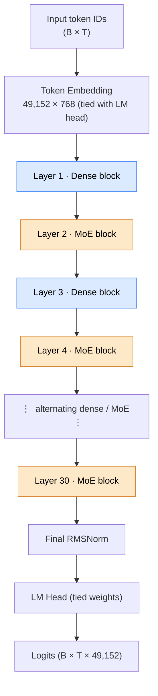
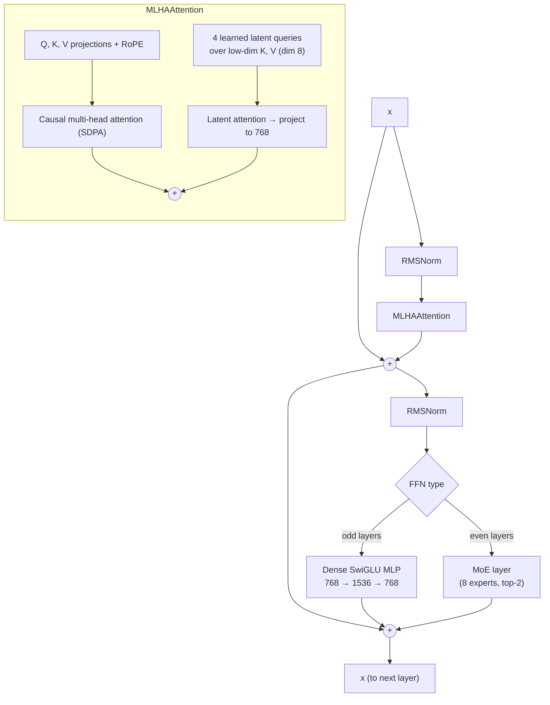
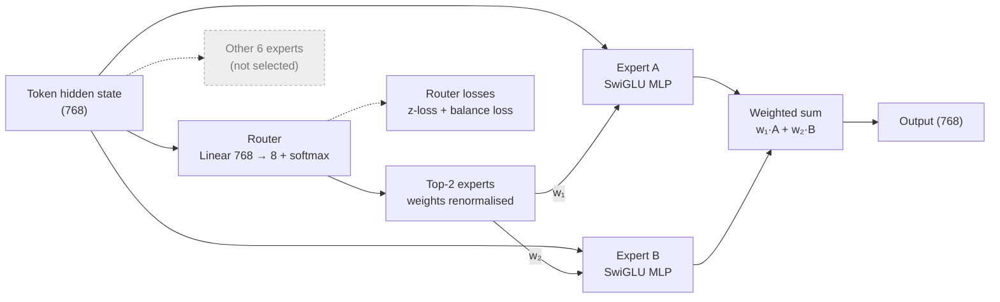

# SmolLM2-MoE: A DeepSeek-Inspired Sparse Language Model, Built From Scratch in PyTorch

A from-scratch implementation of a **~589M-parameter sparse Mixture-of-Experts (MoE) decoder-only language model**. It extends the dense **SmolLM2-135M** design (RMSNorm, SwiGLU, rotary embeddings) with **DeepSeek-style architectural ideas**: shared and routed experts, top-k routing with auxiliary router losses, and a latent-attention branch. The model was trained on **~344M tokens** of streamed synthetic textbook data.

> **Status: research prototype.** The architecture and training pipeline run end to end and the loss drops from 15.3 to about 4.85.

---

## 1. Highlights

| | |
|---|---|
| **Model** | 30-layer decoder-only Transformer, d_model = 768, 12 heads, vocab 49,152 |
| **Sparsity** | MoE FFN in every 2nd layer (15 MoE layers), 8 experts per layer, top-2 routing |
| **Parameters** | **≈588.6M total**, **≈270.2M active per token** (derived analytically from the config, see [§4](#4-parameter-accounting)) |
| **Data** | `HuggingFaceTB/smollm-corpus`, `cosmopedia-v2` split, streamed, with the `cosmo2-tokenizer` |
| **Training** | 10,000 steps plus a 500-step checkpoint-resume run, batch 32 × 1024 tokens (32,768 tok/step), bf16 autocast, `torch.compile`, AdamW |
| **Throughput** | **~62K tokens/s** steady state (~0.53 s/step) |
| **Result** | Train loss **15.32 → ~4.85** (cross-entropy plus router losses) |

**Skills demonstrated:** Transformer internals (RoPE, RMSNorm, SwiGLU, GQA); sparse MoE routing and auxiliary losses; streaming data pipelines; mixed-precision and compiled training; checkpoint save/resume; debugging and critical review of one's own research code.

---

## 2. Repository Layout

```
Task-15/
├── smollm2.py              # Baseline SmolLM2-135M: config, RMSNorm, GQA attention + RoPE, SwiGLU MLP, Block, model
├── deepseek_smollm2.py     # DeepSeek-inspired variant: DeepSeekConfig, MLHAAttention, MoELayer, DeepSeekBlock, DeepSeekModel
├── dataloaderlite.py       # Streaming tokenizing data loader (Cosmopedia-v2 + cosmo2 tokenizer)
├── smolm2_deepseek.ipynb   # Training notebook: setup, 10K-step training loop, periodic sampling, checkpoint, resume
└── inference.ipynb         # Loads model.pt (strips torch.compile `_orig_mod.` prefix) and generates text
```

---

## 3. Architecture

### 3.1 Baseline: SmolLM2-135M (`smollm2.py`)

A modern Llama-style decoder, re-implemented without `transformers` model classes:

- **RMSNorm** pre-normalization (no mean-centering, learned scale).
- **Rotary position embeddings (RoPE)**, θ = 10,000. A cos/sin cache is precomputed and applied to Q and K in interleaved-pair form.
- **Grouped-Query Attention (GQA)**: 12 query heads share 3 KV heads, so the KV projections are 4× smaller. K/V are expanded with `repeat_interleave`, and attention uses `F.scaled_dot_product_attention(is_causal=True)` (FlashAttention path when available).
- **SwiGLU MLP**: `down(SiLU(gate(x)) * up(x))`, intermediate size 1536.
- **Tied input/output embeddings**, with init std = 1/24 ≈ 0.0417.

### 3.2 DeepSeek-inspired variant (`deepseek_smollm2.py`)

**Full model**



**Inside one `DeepSeekBlock`** (pre-norm, residual connections)



**Inside the `MoELayer`**



**Mixture-of-Experts layer (`MoELayer`)**
- 8 experts per MoE layer (7 "routed" + 1 "shared" module), each an independent SwiGLU MLP.
- A linear **router** produces softmax probabilities per token. The **top-2** experts are selected and their weights renormalized to sum to 1.
- Tokens are dispatched per expert with boolean masks, and expert outputs are combined by router weight.
- **Router regularizers:** a z-loss (penalizes large router logits, coefficient 1e-3) and a load-balancing auxiliary loss (coefficient 1e-3). Both are added to the cross-entropy during training.
- MoE is applied every `moe_layer_freq = 2` layers, which keeps total capacity high while leaving half the layers dense.

**Latent attention branch (`MLHAAttention`)**
- A standard multi-head causal attention path (4 × 768² projections, RoPE, SDPA).
- A parallel **latent path**: 4 learned latent query vectors (dim 8 = `latent_dim 64 / compression_ratio 8`) attend over low-dimensional keys and values projected from the sequence. The result is projected back to 768-d and **added** to the main attention output.

**Loss:** `L = CE(logits, targets) + 0.001·Σ z_loss + 0.001·Σ aux_loss`

### 3.3 Config at a glance

| Hyperparameter | Value |
|---|---|
| Layers / hidden / heads | 30 / 768 / 12 (head_dim 64) |
| FFN intermediate | 1536 (SwiGLU) |
| Experts / top-k / shared | 8 / 2 / 1 |
| MoE frequency | every 2nd layer (15 MoE + 15 dense) |
| Latent heads / latent dim | 4 / 8 |
| Context length | 1024 |
| Vocab | 49,152 (cosmo2 tokenizer) |
| Norm / activation | RMSNorm (ε = 1e-5) / SiLU |

---

## 4. Parameter Accounting

Computed by hand from the config (no PyTorch run needed):

| Component | Params |
|---|---|
| Token embedding (tied with LM head) | 37,748,736 |
| Dense block (attention 2.43M + MLP 3.54M + norms) | 5,973,536 × 15 |
| MoE block (attention 2.43M + 8 experts 28.3M + router + norms) | 30,752,288 × 15 |
| Final RMSNorm | 768 |
| **Total** | **≈ 588.6M** |
| **Active per token** (top-2 of 8 experts) | **≈ 270.2M** |

This is the sparse-compute point of MoE: about 2.2× more parameters than are exercised per token. Verify with `sum(p.numel() for p in model.parameters())`.

---

## 5. Data Pipeline (`dataloaderlite.py`)

1. Load the `cosmopedia-v2` subset of `HuggingFaceTB/smollm-corpus` in **streaming mode**, so nothing is downloaded up front and memory stays flat.
2. Tokenize each document with `HuggingFaceTB/cosmo2-tokenizer`.
3. Concatenate tokens until `B·T + 1` are available, then form **input/target pairs by shifting by one** (`x = t[:-1]`, `y = t[1:]`), reshaped to `(B, T)`.
4. If the stream is exhausted, the iterator restarts.

---

## 6. Training Setup (`smolm2_deepseek.ipynb`)

| Setting | Value |
|---|---|
| Optimizer | AdamW, lr = 3e-4 (constant) |
| Batch | 32 sequences × 1024 tokens = 32,768 tokens/step |
| Steps | 10,000 main run, then 500 additional steps after reloading the checkpoint |
| Precision | `torch.autocast(bfloat16)` and `torch.set_float32_matmul_precision('high')` |
| Compilation | `torch.compile(model)` |
| Monitoring | Per-step loss, step time and tokens/s; sample generation every 250 steps (top-k = 40, T = 1.0) |
| Persistence | Full checkpoint (model and optimizer) and a weights-only `model.pt` |
| Seed | 1337 |

### Results

| Metric | Value |
|---|---|
| Initial loss (step 0) | 15.32 |
| Loss at step 10 / 20 | 9.90 / 8.23 |
| Final loss (steps 9,990–9,999) | ≈ 4.8–5.0 |
| Loss after resume (500 more steps) | ≈ 4.80–4.95, so the resume restores a consistent state |
| Steady-state throughput | ≈ 62K tok/s (≈ 520–550 ms/step) |
| Tokens seen | ≈ 328M (main run), ≈ 344M including the resume run |
| Compile warm-up | ≈ 33 s on step 0 |

**Sample generation after 10K steps** (prompt: *"This is a fixed text used for prediction."*):

> *"As we need to understand the complex problems for your journey toward their personal life. Now that we aim to find the power of the context of self-term sustainability…"*

Output is locally fluent and on the textbook-style register of Cosmopedia, but not globally coherent.

---

## 7. How to Run

```bash
# 1. Environment (project uses uv)
source .venv/bin/activate
uv pip install torch transformers datasets numpy

# 2. Train: open and run all cells of
jupyter notebook smolm2_deepseek.ipynb       # writes llm_checkpoint.pt and model.pt

# 3. Generate: run
jupyter notebook inference.ipynb             # loads model.pt, prints a sample
```

Notes:
- The notebooks hard-code `cuda:1`; change this to `cuda:0` or `cpu` for your machine.
- `inference.ipynb` strips the `_orig_mod.` prefix that `torch.compile` adds to state-dict keys.
- Training needs a CUDA GPU (`torch.cuda.synchronize()` is called each step).
- The hardware used for the reported throughput was not recorded in the repo. Add GPU model and VRAM here before sharing.

---

## 8. Roadmap

1. Implement true **MLA** (low-rank KV compression, with decoupled RoPE) and **DeepSeekMoE** (fine-grained experts plus always-on shared experts).
2. Replace the aux loss with the standard **fᵢ·Pᵢ balance loss** (or DeepSeek-V3's auxiliary-loss-free bias balancing). Log per-expert load and router entropy.
3. Add **warm-up plus cosine LR**, grad clipping, a validation split, and perplexity.
4. Ablations at matched active-parameter budget: dense vs. MoE vs. MoE + latent attention. Report loss against tokens and against FLOPs.
5. Efficient dispatch (sort-based or grouped GEMM) to remove compile graph breaks and raise MFU. Report MFU.
6. Add unit tests (shape, causality, routing sums to 1) and a requirements/`pyproject.toml`.
7. Evaluate on HellaSwag, ARC, or PIQA with `lm-evaluation-harness`.

---

## 9. References

- Allal et al., *SmolLM2: When Smol Goes Big* (Hugging Face, 2025). SmolLM2 and the smollm-corpus.
- DeepSeek-AI, *DeepSeek-V2* (2024) and *DeepSeek-V3* (2024). MLA, DeepSeekMoE, aux-loss-free balancing.
- Dai et al., *DeepSeekMoE* (2024).
- Fedus et al., *Switch Transformers* (2021). Top-k routing and load-balancing loss.
- Zoph et al., *ST-MoE* (2022). Router z-loss.
- Su et al., *RoFormer* (2021). RoPE. Ainslie et al., *GQA* (2023). Zhang & Sennrich, *RMSNorm* (2019). Shazeer, *GLU Variants* (2020).
